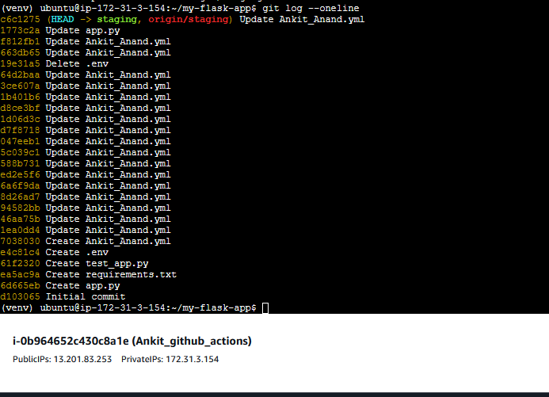
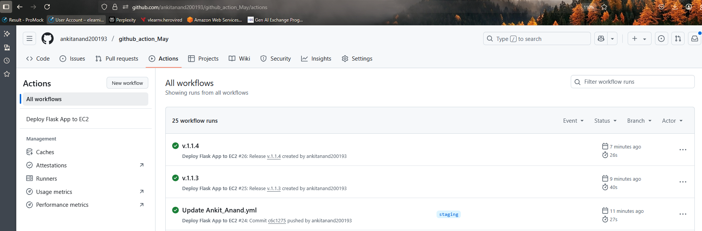
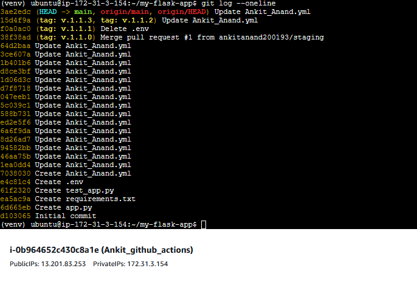
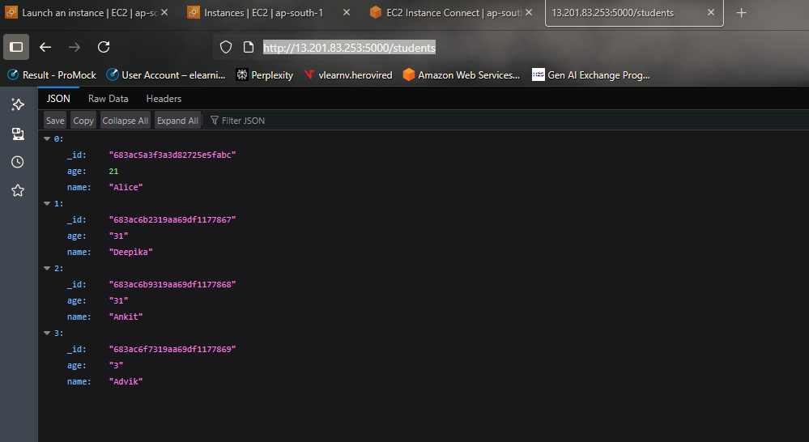
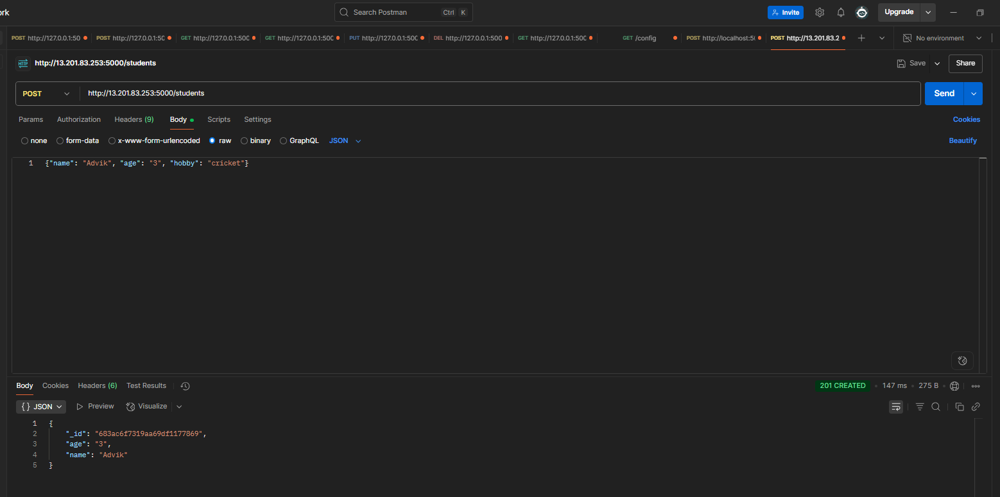
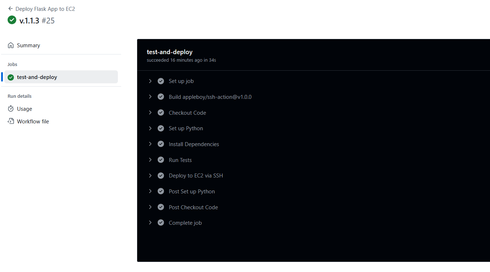
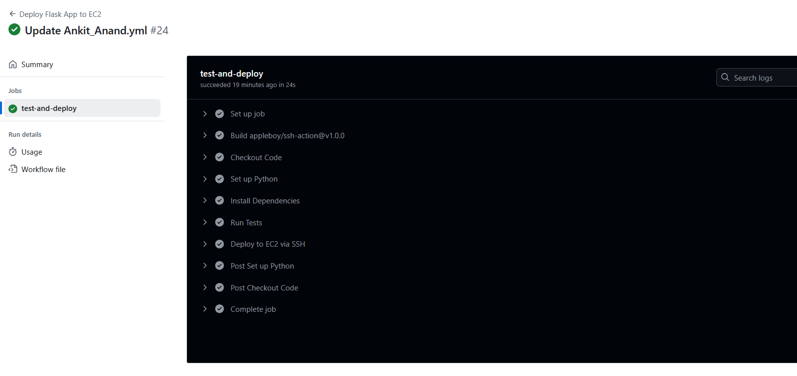

# Flask App CI/CD Pipeline to AWS EC2 using GitHub Actions

This project demonstrates a full CI/CD workflow for deploying a Flask application to an AWS EC2 instance using **GitHub Actions**. It includes automated testing, secure SSH-based deployment, and environment-based branching logic.

---

##  Features

*  Continuous Integration with `pytest`
*  Continuous Deployment to EC2 via `appleboy/ssh-action`
*  Environment isolation with Python virtualenv
*  Auto-deploy on:

  * `release` creation → deploys from `main` branch
  * `push` to `staging` branch → deploys from `staging`
*  Environment variable management via GitHub Secrets
*  Auto-kills any process using port `5000`
*  Runs Flask app in a persistent `tmux` session

---

##  CI/CD Workflow Summary

This pipeline runs under two triggers:

* **On Push to `staging` branch:**
  Pulls the latest `staging` code and deploys it to EC2.


* **On Release Creation (GitHub Releases):**
  Pulls the `main` branch and deploys it to EC2.


### GitHub Actions Steps

1. **Checkout Repository**
2. **Setup Python 3.12**
3. **Install Python Dependencies**
4. **Run Unit Tests using Pytest**
5. **SSH into EC2 Instance and Deploy:**

   * Install required system packages
   * Clone or pull repo (based on trigger)
   * Create `.env` file with MongoDB URI
   * Setup virtual environment
   * Install Python requirements
   * Kill existing process on port 5000
   * Launch Flask app in a detached `tmux` session

---

##  Testing

Unit tests are located in the `test_app.py` file and are run using `pytest`. The pipeline will fail if any tests fail.

---

##  Deployment Details

* **EC2 Instance Requirements:**

  * Ubuntu-based instance
  * Inbound rules allowing port 5000
  * SSH key added as GitHub Secret (`EC2_KEY`)
  * User: `ubuntu`

* **Secrets Required in GitHub:**

  | Secret Name | Description                      |
  | ----------- | -------------------------------- |
  | `EC2_HOST`  | Public IP or DNS of EC2 instance |
  | `EC2_KEY`   | SSH private key for access       |
  | `MONGO_URI` | Your MongoDB connection string   |

---

##  How to Use

### 1. Push to Staging

```bash
git checkout -b staging
git push origin staging
```

→ Automatically runs tests and deploys to EC2 using `staging` branch.

### EC2 staging git logs matche with the pipeline
  
  

### github pipeline

   

### 2. Create a Production Release

Go to GitHub → Releases → **Draft a new release**

* Set target branch to `main`
* Click **Publish release**

→ Deploys production-ready code from `main` branch to EC2.

  ### EC2 main git logs

   


---

##  Flask App Notes

Make sure your `app.py` contains:

```python
if __name__ == "__main__":
    app.run(host="0.0.0.0", port=5000)
```
## App main page

 

## App database 

 

## Postman data entry

 

## Release Github Pipeline

 

## Staging Github Pipeline

 

